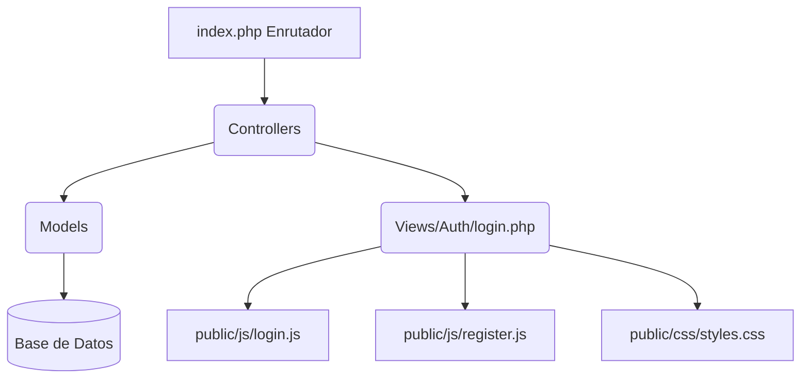

# Zooki - Sistema de Gestión Veterinaria Inteligente

Zooki es un sistema web moderno, robusto y eficiente diseñado para la gestión integral de clínicas veterinarias. Facilita la administración de pacientes (mascotas), historias clínicas, citas, y ofrece autenticación nativa segura e inicio de sesión integrado mediante Google Identity Services.

## Historial de Versiones

### Versión 1.4.0 (Actual)
Esta versión se enfoca en resolver fallas visuales de adaptabilidad móvil (responsive), optimizaciones críticas en la entrega y renderizado de correos electrónicos, y la mejora de la experiencia de usuario en la gestión de contraseñas.

*   **Incrustación de Imágenes CID (Emailing):** Las imágenes del logotipo y del ícono de Zooki ahora se adjuntan directamente en el cuerpo del correo como imágenes incrustadas usando CID (`cid:zooki_icon_blue`, `cid:zooki_logotipo`). Esto garantiza la carga inmediata y evita el bloqueo de imágenes externas en gestores de correo como Gmail y Outlook.
*   **Correos de Bienvenida Automáticos:** Implementación del envío inmediato de un correo de bienvenida a los nuevos usuarios al registrarse, tanto por el flujo tradicional de correo como al completar el registro con Google.
*   **Autenticación Inteligente en Perfil:** Se añadió la detección del método de inicio de sesión (`google` o `password`). Si un usuario ingresó con Google, se oculta el campo de "Contraseña Actual" en su perfil (ya que carece de ella), permitiéndole establecer una nueva contraseña de forma directa.
*   **Seguridad y Corrección en Cambio de Clave:** Se añadió la validación de la contraseña actual en el backend para usuarios que ingresaron con credenciales normales. Además, se solucionó un error que impedía guardar los cambios de contraseña voluntaria desde el perfil.
*   **Correcciones Visuales (UI/UX):**
    *   **Bordes de Inputs en Google Modal:** Se agregaron bordes consistentes e iconos visibles en los campos del modal de completar registro de Google.
    *   **Control de Desbordamiento:** Se implementó `word-break: break-all` y `min-width: 0` para evitar que correos electrónicos largos desborden la tarjeta de perfil del propietario o la tarjeta del modal de Google.

### Versión 1.3.0
*   **Gestión Autónoma de Mascotas por el Propietario:**
    *   Botón de agregar mascota (+) en el panel de inicio del portal del propietario.
    *   Botón de editar perfil de mascota en la barra del drawer de detalles.
    *   Integración de formularios móviles e intuitivos de registro y edición que admiten: foto de perfil (con limitación a 5MB, JPG/PNG), especie, raza (incluida creación dinámica con opción "Otra"), sexo, peso, fecha de nacimiento y selección múltiple de colores base (tipo tags/pills).
    *   Métodos y rutas seguras en el backend (`portal_registrar_mascota_ajax` y `portal_actualizar_mascota_ajax`) que aseguran que el dueño en sesión solo pueda crear o modificar mascotas de su pertenencia.
*   **Agendamiento de Citas Inteligente:**
    *   Modificación de la carga de horas disponibles en el formulario de citas del propietario.
    *   Integración de los endpoints `get_horas_disponibles_ajax` y `get_sugerencias_horario_ajax` para intersectar las horas hábiles de la clínica con la disponibilidad del veterinario. De esta manera, el propietario solo ve y puede agendar horas libres reales, evitando el solapamiento.
*   **Corrección de Bug en Carga de Datos de Mascotas (Entornos Unix/Linux):** Se solventó un error crítico de producción en el portal del propietario donde no se podían cargar los detalles de las mascotas. La causa raíz radicaba en la sensibilidad a mayúsculas/minúsculas de los nombres de tablas SQL en sistemas Linux (ej. referencias de Mascotas y Usuarios que debían ser estrictamente mascotas y usuarios en minúsculas).
*   **Estandarización de Consultas SQL:** Se normalizaron y corrigieron las consultas en los siguientes modelos y controladores:
    *   Vacuna.php
    *   Usuario.php
    *   Consulta.php
    *   VacunaController.php
    *   ConsultaController.php
    *   CitaController.php

### Versión 1.2.0
*   **UI/UX Frontend:**
    *   Rediseño completo del Portal de Propietario con apariencia inspirada en aplicaciones móviles.
    *   Implementación de barra de navegación inferior (Bottom Navigation Bar).
    *   Incorporación de carrusel de mascotas para una experiencia más dinámica.
    *   Actualización de la paleta de colores con un diseño más limpio y moderno.
*   **Módulo de Citas:**
    *   Agregadas las rutas AJAX faltantes en `index.php`: `portal_get_vets_ajax`, `portal_get_tipos_cita_ajax`, `portal_agendar_cita_ajax`.
    *   Los propietarios ahora pueden agendar citas directamente desde el portal.
*   **Seguridad y Gestión de Perfil:**
    *   Eliminado el modal de cambio de contraseña.
    *   Implementado un menú desplegable en la sección **Mi Cuenta** para gestionar opciones del perfil.
    *   Añadida validación de seguridad en tiempo real mediante una barra de fortaleza de contraseña.
    *   Actualizado el modelo `Usuario.php` para obtener y mostrar correctamente: Correo electrónico del propietario y número de teléfono del propietario.
*   **Corrección de Errores (Bug Fixes):**
    *   Corregido un Error 500 en el sistema de notificaciones: Ajuste de las claves de sesión `usuario_doc` y `usuario_id_rol` y corrección de la ruta absoluta hacia la base de datos en `NotificacionInterna.php`.
    *   Mejorada la visualización de estados vacíos (sin citas, sin vacunas, etc.) mediante componentes tipo tarjeta, eliminando la presentación en texto plano.

### Versión 1.1.0
Esta versión introduce una renovación completa del canal de comunicación por correo electrónico, mejoras críticas de estabilidad en entornos locales de desarrollo y optimizaciones en la seguridad de autenticación.

*   **Rediseño de Correos estilo Slack:** Todas las notificaciones por correo (restablecimiento de contraseña, bienvenida con credenciales y recordatorios de citas/vacunas) se actualizaron a una maquetación moderna de estilo Slack.
*   **Centralización de Plantillas HTML:** Se implementó `EmailService::obtenerPlantillaBaseHTML()` para unificar el header y el footer con el logotipo oficial, reduciendo la duplicación de código.
*   **Enlaces Absolutos Dinámicos:** Integración de la variable `APP_URL` en el archivo `.env` para construir enlaces seguros y absolutos tanto en local como en producción.
*   **Seguridad de Contraseñas (Reset & Registro):** Incorporación del medidor de seguridad, bloqueo de submit inseguro y botón de ojo de visibilidad para contraseñas.
*   **Corrección de Dobles Bordes y Padding:** Solución al error visual de herencia de inputs que producía un doble borde y recortaba la primera letra en las pantallas y modales de autenticación.
*   **Conexión Tolerante a Fallos:** Optimización del tiempo de respuesta DNS en Windows para bases de datos locales y fallback inteligente de credenciales (Docker/XAMPP).

---

## Guía de la Primera Versión Estable (v1.0.0)

Esta primera versión establece el núcleo de autenticación y acceso seguro al sistema. Se centra en proveer una experiencia de usuario (UX) sumamente fluida y atractiva mediante un diseño basado en Bento Grid, garantizando al mismo tiempo los más altos estándares de seguridad web.

### Funcionalidades Implementadas en v1.0.0
*   **Bento Grid Collage:** Interfaz visual premium inspirada en cuadrículas de estilo bento, adaptable y con animaciones de entrada.
*   **Animación de Flip Container:** Transición interactiva en 3D para alternar entre el formulario de inicio de sesión (Login) y el formulario de creación de cuenta (Registro) sin recargar la página.
*   **Google OAuth Integrado:** Autenticación rápida a través del SDK oficial de Google (Google Identity Services).
*   **Flujo de Registro Completo de Google:** Si un usuario de Google ingresa por primera vez, el sistema detecta que faltan datos clave y despliega un modal interactivo para capturar la cédula/documento, tipo de documento y número de teléfono antes de completar el registro.
*   **Seguridad CSRF:** Implementación de tokens CSRF para todos los formularios (Login y Registro) mediante una clase helper dedicada (`Csrf.php`).
*   **Validaciones en Tiempo Real:** Validación dinámica de fortaleza de contraseña, coincidencia de campos y números de identificación.
*   **Bloqueo de Interacción (Drag & Selection):** Deshabilitado el arrastre (`draggable="false"`) y la selección de texto en los elementos visuales del Bento Grid y el logotipo principal para brindar la sensación de una aplicación nativa.
*   **SweetAlert2 Integrado:** Notificaciones y modales interactivos para alertas de recuperación de contraseña y avisos de portal.

---

## Arquitectura del Sistema

El proyecto está construido bajo una arquitectura **MVC (Modelo-Vista-Controlador)** con PHP puro:



### Estructura de Directorios
*   `/config/`: Configuración global del sistema, conexión a base de datos y utilidades.
*   `/controllers/`: Controladores encargados del procesamiento de peticiones y lógica del sistema.
*   `/models/`: Modelos de base de datos que representan las tablas principales (usuarios, mascotas).
*   `/views/`: Vistas PHP estructuradas. Las vistas de autenticación están en `/views/auth/`.
*   `/helpers/`: Clases de apoyo enfocadas en la seguridad (`Security.php`, `Csrf.php`).
*   `/public/`: Único punto de acceso del cliente. Contiene:
    *   `css/styles.css`: Estilos unificados del sistema.
    *   `js/login.js`: Lógica de animación de flip, alertas, modales e integración de Google.
    *   `js/register.js`: Validación en tiempo real y flujo de registro.
    *   `img/`: Recursos gráficos e imágenes del collage del Bento Grid.

---

## Guía de Instalación y Configuración

### Requisitos del Sistema
*   Servidor web Apache o Nginx.
*   PHP 8.0 o superior (con extensiones `pdo_mysql`, `openssl` y `json` habilitadas).
*   Servidor MySQL/MariaDB.
*   Composer (para gestión de dependencias en caso de requerirse).

### Configuración Paso a Paso

1.  **Clonar el Proyecto:**
    ```bash
    git clone <url_de_tu_repositorio>
    ```

2.  **Configurar Variables de Entorno (.env):**
    Duplica el archivo `.env.example` en la raíz, renombralo como `.env` e ingresa tus credenciales de base de datos y tu ID de cliente de Google:
    ```env
    DB_HOST=localhost
    DB_NAME=zooki_db
    DB_USER=root
    DB_PASS=tu_contraseña

    # Google Identity Services API Client ID
    GOOGLE_CLIENT_ID=tu_client_id_de_google.apps.googleusercontent.com
    ```

3.  **Configuración de Servidor Local (Virtual Host):**
    Se recomienda configurar un Host Virtual que apunte al directorio `public/` del proyecto para el correcto funcionamiento de las rutas relativas.

4.  **Importar la Base de Datos:**
    Importa el esquema SQL inicial ubicado en `database/schema.sql` (si está presente) en tu servidor MySQL.

## Modelo de Base de Datos

Zooki cuenta con un esquema relacional estructurado en MySQL para garantizar la integridad y auditoría de la información clínica. Las tablas principales se dividen en:

*   **Autenticación y Roles:**
    *   `roles`: Define accesos (`administrador`, `veterinario`, `recepcionista`, `propietario`).
    *   `usuarios`: Almacena documentos de identidad, correos (únicos) y contraseñas seguras.
    *   `password_resets`: Tokens temporales con caducidad para el restablecimiento de contraseñas.
*   **Gestión Veterinaria:**
    *   `especies` y `razas`: Catálogos precargados para la correcta catalogación de pacientes.
    *   `mascotas`: Pacientes asociados a su respectivo propietario, incluyendo raza, peso, sexo e historial.
    *   `colores_base` y `mascota_colores`: Relación de muchos a muchos para el pelaje de las mascotas.
    *   `vacunas`: Registro detallado del historial de vacunación y próximas dosis para los pacientes.
    *   `desparasitaciones`: Control y dosificación de tratamientos preventivos de desparasitación interna y externa.
*   **Operación Diaria:**
    *   `tipos_cita`: Tipos de cita parametrizados con su respectiva duración (Consulta general, cirugía, etc.).
    *   `citas`: Control de agenda médica con restricciones de unicidad para evitar cruces de horarios de veterinarios.
    *   `consultas`: Registros clínicos de anamnesis, constantes fisiológicas (peso, temperatura, frecuencia cardíaca), diagnóstico y plan de tratamiento.
    *   `tratamientos`: Medicamentos, dosis, vías de administración y duración asociados a las consultas clínicas.
    *   `archivos_clinicos`: Almacenamiento e indexación de archivos externos adjuntos (exámenes de laboratorio, radiografías) vinculados a una consulta.
    *   `notificaciones` (externas por email) y `notificaciones_internas` (en la plataforma): Canales de alerta para recordar citas, avisar eventos o enviar mensajes administrativos por rol o usuario.
*   **Seguridad y Control:**
    *   `auditoria_mascotas`: Historial de modificaciones de campos clave en los pacientes para mantener la trazabilidad de los cambios.
    *   `auditoria_sistema`: Log detallado de operaciones de seguridad (LOGIN, LOGOUT, LOGIN_FAIL) e inserción, modificación o eliminación de datos, registrando información en formato JSON (datos anteriores y nuevos) junto con la IP y fecha.

---

## Principios de Diseño (SOLID)

El diseño arquitectónico de Zooki cubre de forma parcial los principios **SOLID** para asegurar un código mantenible a medida que el sistema escala, adaptándolos pragmáticamente a un entorno PHP nativo rápido:

*   **Responsabilidad Única (SRP):** Aplicado parcialmente mediante helpers de seguridad (`Csrf.php`, `Security.php`) y enrutadores dedicados que aíslan la lógica de autenticación de la presentación visual.
*   **Abierto/Cerrado (OCP):** Modularidad en el enrutamiento centralizado que permite agregar nuevas rutas de controladores sin modificar la estructura del despachador inicial.
*   *Nota:* Para mantener la ligereza y rapidez en las operaciones CRUD, ciertos flujos de bases de datos y controladores acoplan directamente lógica para evitar sobrecarga de abstracciones innecesarias.

## Esquema de Versionamiento (Zooki SemVer)

Zooki utiliza un esquema de versionamiento semántico adaptado a la distribución de componentes del sistema: **`X.Y.Z`**

*   **`X` (Mayor):** Cambios de gran impacto en la lógica de negocio general, reestructuración masiva del sistema, cambios mayores de arquitectura o lanzamientos de nuevas versiones globales (Ej: de `1.0.0` a `2.0.0`).
*   **`Y` (Backend / Backend + Frontend):** Cambios en la lógica del backend (controladores, modelos, migraciones de base de datos). Si un cambio en el backend requiere actualizar vistas u hojas de estilos (afectando también al frontend), este dígito se incrementará (Ej: de `1.0.0` a `1.1.0`).
*   **`Z` (Frontend Puro):** Cambios exclusivos del frontend (mejoras de estilo CSS, animaciones, lógica JavaScript del lado del cliente, layouts) que no afectan ni modifican controladores ni bases de datos (Ej: de `1.0.0` a `1.0.1`).

---

© 2026 Zooki Veterinary Management App. Todos los derechos reservados.
